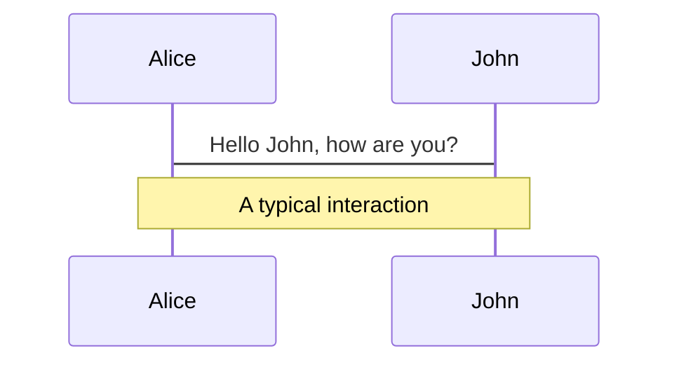
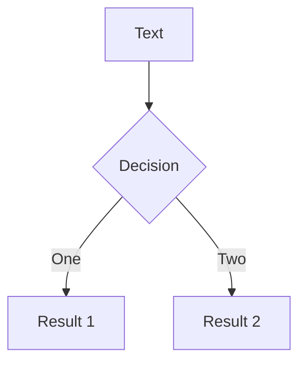

---
src: ./slides/what-is-css.md
---

---
src: ./slides/css-properties.md
---

---

# The box model

On the previous slide, we used the `padding` property to add space _inside_ an element. Padding is not the only spacing property - we also have `margin` and `border`.

```css{3,5-12|4}
.📦 {
  background-color: hsl(214deg 72% 72%);
  border: 12px solid hsl(214deg 72% 60%);
  box-shadow: 0 0 0 1rem hsl(214deg 72% 52%);
  margin-bottom: 1rem;
  margin-left: 1rem;
  margin-right: 1rem;
  margin-top: 1rem;
  padding-top: 1rem;
  padding-right: 2rem;
  padding-bottom: 1rem;
  padding-left: 2rem;
}
```

<div style="
  background-color: hsl(214deg 72% 72%);
  border: 1rem solid hsl(214deg 72% 60%);
  box-shadow: 0 0 0 1rem hsl(214deg 72% 52%);
  margin-bottom: 1rem;
  margin-left: 1rem;
  margin-right: 1rem;
  margin-top: 1rem;
  padding-top: 1rem;
  padding-right: 2rem;
  padding-bottom: 1rem;
  padding-left: 2rem;
">
  Here's some content 💃
</div>
<!--
The three different components of the CSS box model is `margin`, `border` and `padding`. All of these add up when calculating the size of the element. An element with none of these, and no `height` or `width` set will get its size from its contents. Many people find it hard to remember the difference between `margin` and `padding`, but try to think of it like this: `margin` is for the element what `padding` is for its contents. 

Just as a side note: To visualize the `margin`, which is inherently transparent, I've used `box-shadow`. Together with `outline`, `box-shadow` is not part of the box model, simply because it does not take up any space. Therefore, `box-shadow` can be used in a few different hacks like this.
-->

---

# `display`

The display property has loads of different values it can be set to. A few are `block`, `flex`, `grid`, `table`, `inline`, `inline-block` and `none`. Each of these do wildly different things and if you get these right, layouting will become much easier.

- inline vs block

<!--
A few elements are `inline` as default. Some are `span`, `image`, `strong` and `a`. These will not take up more space vertically even if they have `padding` set. These also cannot be transformed with the `transform` property, and the `height` and `width` properties have no effect on them.

Block elements, on the other hand, will by default be as wide as their container, and we cannot put another element next to them (unless the parent has display: flex or grid). Therefore, setting an inline element to display as a block might not be what we want. As a middle ground, a transformable, content-wide element, we can use `display: inline-block`.
-->

---

# `height` and how to set percentages

---

# `display: none` vs `visibility: hidden` vs `opacity: 0`

---

# Units (rem vs em vs px)

---

# Shorthand properties

---

# position: static

Say you want to position an element with `top` and `left` within its container.

---

# Margin collapse

---

# Property ordering

Given that no properties are repeated within the same selector, this generally doesn't matter, but for clean code purposes, using some kind of pre-determined ordering helps. I myself prefer alphabetical order, while some other people like to group the properties by functionality.

---

# Selector specificity

---

# Why CSS-in-JS?

- Code splitting
- Avoid selectors leaking (scoped styles)

---

# Transitions

---

# box-sizing

---

# Centering horizontally

---

# Navigation

Hover on the bottom-left corner to see the navigation's controls panel, [learn more](https://sli.dev/guide/navigation.html)

## Keyboard Shortcuts

|                                                    |                             |
| -------------------------------------------------- | --------------------------- |
| <kbd>right</kbd> / <kbd>space</kbd>                | next animation or slide     |
| <kbd>left</kbd> / <kbd>shift</kbd><kbd>space</kbd> | previous animation or slide |
| <kbd>up</kbd>                                      | previous slide              |
| <kbd>down</kbd>                                    | next slide                  |

<!-- https://sli.dev/guide/animations.html#click-animations -->


<p v-after class="absolute bottom-23 left-45 opacity-30 transform -rotate-10">Here!</p>

---

layout: image-right
image: <https://source.unsplash.com/collection/94734566/1920x1080>

---

# Code

Use code snippets and get the highlighting directly![^1]

```ts {all|2|1-6|9|all}
interface User {
  id: number;
  firstName: string;
  lastName: string;
  role: string;
}

function updateUser(id: number, update: User) {
  const user = getUser(id);
  const newUser = { ...user, ...update };
  saveUser(id, newUser);
}
```

<arrow v-click="2" x1="400" y1="420" x2="230" y2="330" color="#564" width="3" arrowSize="1" />

[^1]: [Learn More](https://sli.dev/guide/syntax.html#line-highlighting)

<style>
.footnotes-sep {
  @apply mt-20 opacity-10;
}
.footnotes {
  @apply text-sm opacity-75;
}
.footnote-backref {
  display: none;
}
</style>

---

# Components

<div grid="~ cols-2 gap-4">
<div>

You can use Vue components directly inside your slides.

We have provided a few built-in components like `<Tweet/>` and `<Youtube/>` that you can use directly. And adding your custom components is also super easy.

```html
<Counter :count="10" />
```

<!-- ./components/Counter.vue -->
<Counter :count="10" m="t-4" />

Check out [the guides](https://sli.dev/builtin/components.html) for more.

</div>
<div>

```html
<Tweet id="1390115482657726468" />
```

<Tweet id="1390115482657726468" scale="0.65" />

</div>
</div>

---

## class: px-20

# Themes

Slidev comes with powerful theming support. Themes can provide styles, layouts,
components, or even configurations for tools. Switching between themes by just
**one edit** in your frontmatter:

<div grid="~ cols-2 gap-2" m="-t-2">

```yaml
---
theme: default
---
```

```yaml
---
theme: seriph
---
```


</div>

Read more about [How to use a theme](https://sli.dev/themes/use.html) and
check out the [Awesome Themes Gallery](https://sli.dev/themes/gallery.html).

---

## preload: false

# Animations

Animations are powered by [@vueuse/motion](https://motion.vueuse.org/).

```html
<div v-motion :initial="{ x: -80 }" :enter="{ x: 0 }">Slidev</div>
```

<div class="w-60 relative mt-6">
  <div class="relative w-40 h-40">
    
    
    
  </div>

  <div
    class="text-5xl absolute top-14 left-40 text-[#2B90B6] -z-1"
    v-motion
    :initial="{ x: -80, opacity: 0}"
    :enter="{ x: 0, opacity: 1, transition: { delay: 2000, duration: 1000 } }">
    Slidev
  </div>
</div>

<!-- vue script setup scripts can be directly used in markdown, and will only affects current page -->
<script setup lang="ts">
const final = {
  x: 0,
  y: 0,
  rotate: 0,
  scale: 1,
  transition: {
    type: 'spring',
    damping: 10,
    stiffness: 20,
    mass: 2
  }
}
</script>

<div
  v-motion
  :initial="{ x:35, y: 40, opacity: 0}"
  :enter="{ y: 0, opacity: 1, transition: { delay: 3500 } }">

[Learn More](https://sli.dev/guide/animations.html#motion)

</div>

---

# LaTeX

LaTeX is supported out-of-box powered by [KaTeX](https://katex.org/).

<br />

Inline $\sqrt{3x-1}+(1+x)^2$

Block

$$
\begin{array}{c}

\nabla \times \vec{\mathbf{B}} -\, \frac1c\, \frac{\partial\vec{\mathbf{E}}}{\partial t} &
= \frac{4\pi}{c}\vec{\mathbf{j}}    \nabla \cdot \vec{\mathbf{E}} & = 4 \pi \rho \\

\nabla \times \vec{\mathbf{E}}\, +\, \frac1c\, \frac{\partial\vec{\mathbf{B}}}{\partial t} & = \vec{\mathbf{0}} \\

\nabla \cdot \vec{\mathbf{B}} & = 0

\end{array}
$$

<br />

[Learn more](https://sli.dev/guide/syntax#latex)

---

# Diagrams

You can create diagrams / graphs from textual descriptions, directly in your Markdown.

<div class="grid grid-cols-2 gap-10 pt-4 -mb-6">





</div>

[Learn More](https://sli.dev/guide/syntax.html#diagrams)

---

layout: center
class: text-center

---

# Learn More

[Documentations](https://sli.dev) · [GitHub](https://github.com/slidevjs/slidev) · [Showcases](https://sli.dev/showcases.html)
